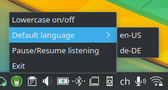

# linux-speech-typer

__Hint: At this point I'd recommend using [ideasman42/nerd-dictation](https://github.com/ideasman42/nerd-dictation)__

It was developed roughly at the same time and has a number of advantages, namely:

* it's faster due to using streaming capabilities
* when used with shortcut activation it avoids potential problems with voice activation
* supports wayland

__Hint 2: Currently this needs a patched version of [Uberi/speech_recognition](https://github.com/Uberi/speech_recognition) that includes this pull request: [ Vosk api: allow selecting different models and automatic model download #657 ](https://github.com/Uberi/speech_recognition/pull/657)__

---

Linux speech-to-text tool w/ system tray

Once running, spoken text will be typed at the current cursor location.

Limitation: Currently this is supporting X-Windows (not Wayland) due to limitation in pynput.

This is based on the python package [Uberi/speech_recognition](https://github.com/Uberi/speech_recognition). It now uses __Vosk API__ (default) and __Google Speech Recognition__ service as backends. Other speech recognition backends are supported by [Uberi/speech_recognition](https://github.com/Uberi/speech_recognition) but currently not implemented here.

Currently the version including [this pull request](https://github.com/Uberi/speech_recognition/pull/657) is used.

## Installation

I recommend using a virtual environment. However, for the system tray `tk` has to be installed system-wide:

    sudo apt-get install python3-tk

git clone the Repository or download the zip file and unzip it. And change into the directory.

    git clone https://github.com/rebootl/linux-speech-typer.git
    cd speech-typer-gui/

Setup and activate the virtual environment (optional):

    python3 -m venv env --system-site-packages
    . env/bin/activate

Install dependencies:

    pip3 install -r requirements.txt

Start:

    ./speech-typer-gui.py

The terminal should say `listening` and you should see the tray icon in the system tray.

To launch it in one step use: `/path-to-installation/env/bin/python /path-to-installation/speech-typer-gui.py`

## Configuration

Different language tags and replacements can be configured in `config.py`.

Find the relevant language codes here: https://cloud.google.com/speech-to-text/docs/languages

The words in the keys dictionary (list) will be executed as corresponding keystrokes.

Please adjust it to your liking.
